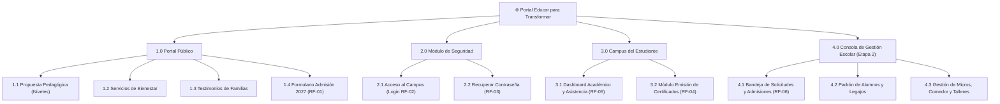
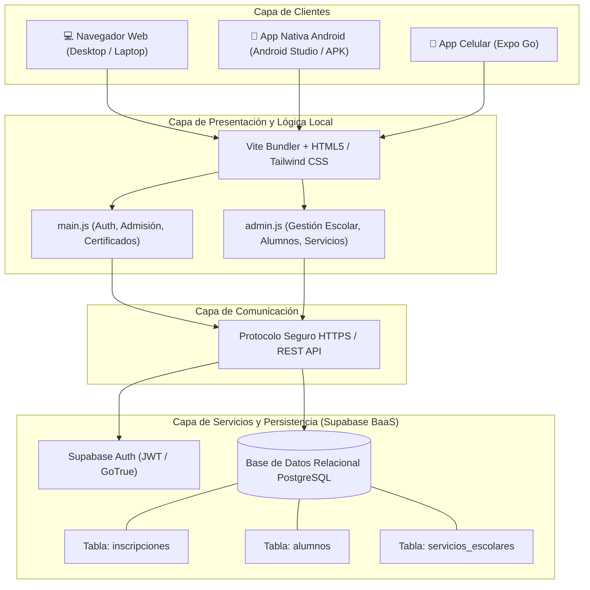
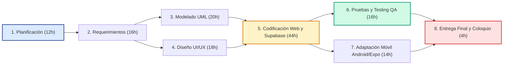

# PLAN DE TRABAJO — PROYECTO
## CENTRO EDUCATIVO "Educar para Transformar" — Sistema de Gestión

---

**UNIVERSIDAD TECNOLÓGICA NACIONAL — FACULTAD REGIONAL RESISTENCIA**  
**Cátedra:** Metodología de Sistemas II  
**Carrera:** Tecnicatura Universitaria en Programación (TUP)  
**Docente:** Ing. Carolina Vargas  
**Año Lectivo:** 2026  

---

### NOMBRE DEL EQUIPO DE TRABAJO
**Equipo 04 — Transformación Digital Educativa**

### APELLIDO Y NOMBRE DEL EQUIPO DE TRABAJO
1. **Vernengo, Gustavo**
2. **Bosch Vesconi, Mateo**

---

## 1. DESCRIPCIÓN DEL PROYECTO

### 1.1. Enunciación del Problema
El Centro Educativo *"Educar para Transformar"* (ubicado en Resistencia, Chaco) gestiona una comunidad educativa de más de 340 alumnos distribuidos en los niveles Inicial, Primario y Secundario. Actualmente, la institución presenta los siguientes problemas operativos y organizacionales:
1. **Proceso de admisión analógico y descentralizado:** Las solicitudes de vacantes para el ciclo lectivo se realizan presencialmente en papel o mediante canales informales de mensajería, ocasionando demoras, pérdidas de registros y duplicación de inscripciones.
2. **Dependencia administrativa para trámites académicos:** Los alumnos regulares y tutores deben acudir en persona a secretaría y aguardar entre 48 y 72 horas para obtener una constancia o certificado de alumno regular con sello y firma.
3. **Falta de visibilidad del rendimiento y asistencia:** Los tutores carecen de un canal digital accesible las 24 horas para consultar el estado académico, asistencia del estudiante y circulares directivas.
4. **Descoordinación en servicios complementarios:** La asignación de rutas de micros escolares, turnos de comedor y talleres extracurriculares (deportes y robótica) se administra en planillas desconectadas sin actualización en tiempo real.

### 1.2. Requerimientos del Sistema de Gestión

#### A. Requerimientos Funcionales (RF)
* **RF-01 (Admisiones):** El sistema debe permitir a tutores aspirantes ingresar sus datos personales (nombre, DNI, nivel escolar, correo y mensaje) y registrar su solicitud de vacante 2027 con persistencia directa en la base de datos.
* **RF-02 (Autenticación y Seguridad):** El sistema debe proveer autenticación segura por correo y contraseña con persistencia de sesión (`Supabase Auth` con tokens JWT).
* **RF-03 (Recuperación de Acceso):** El sistema debe permitir a estudiantes y tutores solicitar el restablecimiento de su clave mediante el despacho de un enlace seguro a su correo electrónico.
* **RF-04 (Autogestión de Certificados):** El sistema debe validar el documento/legajo de los alumnos en condición regular y generar en pantalla el Certificado de Alumno Regular con sello institucional y opción de descarga en PDF.
* **RF-05 (Dashboard Académico):** El sistema debe mostrar al alumno autenticado su porcentaje de asistencia acumulado (ej. 96%), promedio general (8.75), materias activas y avisos institucionales.
* **RF-06 (Gestión Administrativa y Cupos - Etapa 2):** El sistema debe brindar a los directivos una consola para consultar, filtrar por nivel y modificar el estado de solicitudes (Pendiente, Aprobada, Rechazada), gestionar el padrón de alumnos y asignar servicios de transporte y comedor.

#### B. Requerimientos No Funcionales (RNF)
* **RNF-01 (Rendimiento):** Tiempo de respuesta inferior a 1.5 segundos en transacciones de consulta y registro en condiciones normales de red.
* **RNF-02 (Seguridad):** Tráfico cifrado de punta a punta vía HTTPS, almacenamiento seguro de contraseñas con hash criptográfico y políticas de seguridad a nivel de fila (Row Level Security - RLS).
* **RNF-03 (Disponibilidad y Resiliencia):** Uptime superior al 99.5% soportado por la infraestructura en la nube de Supabase (PostgreSQL gestionado).
* **RNF-04 (Usabilidad y Diseño Adaptable):** Interfaz responsive multidispositivo (Mobile, Tablet y Desktop) desarrollada con Tailwind CSS, adaptada para aplicación nativa móvil Android y Expo Go.
* **RNF-05 (Mantenibilidad):** Arquitectura modular desacoplada en JavaScript ES6 empaquetada mediante Vite.

### 1.3. Clasificación del Sistema de Información
El sistema se clasifica como un **Sistema Integrado de Información Escolar** que opera en dos niveles organizacionales:
* **TPS (Transaction Processing System - Sistema de Procesamiento de Transacciones):** A nivel operativo, ejecuta y registra las transacciones del día a día (registro de solicitudes de vacantes en base de datos, validación y expedición instantánea de certificados, autenticación de usuarios).
* **MIS (Management Information System - Sistema de Información Gerencial):** A nivel administrativo/táctico, provee a la Dirección y Secretaría consolas con métricas clave (Total de alumnos: 348, solicitudes pendientes de evaluación, índice de asistencia institucional del 95.8% y estado de rutas de micro).

### 1.4. Arquitectura de la Información (AI)



### 1.5. Arquitectura de la Aplicación de Software

#### A. Aplicación de los Principios
* **Separación de Responsabilidades (SoC):** Desacoplamiento estricto entre la interfaz de usuario (HTML5/Tailwind), los controladores lógicos (`main.js` y `admin.js`) y la capa de datos (Supabase BaaS).
* **Principio de Responsabilidad Única (SRP):** Cada función realiza una tarea concreta (ej. `validarFormularioAdmision()`, `enviarDatosAdmisionASupabase()`, `actualizarEstadoBotonEnvio()`).
* **Principio DRY (Don't Repeat Yourself):** Reutilización de controladores comunes, como `alternarVisibilidadModal()` para todos los modales del sistema.
* **Seguridad por Diseño (Security by Design):** Delegación de la criptografía y gestión de sesiones a proveedores certificados (GoTrue/Supabase).

#### B. Componentes
* **Componentes Funcionales:**
  - *Front-End Web SPA:* Renderizado reactivo en el navegador con Vite y Tailwind CSS.
  - *Controlador de Usuario (`main.js`):* Orquestador de autenticación, admisión y certificados.
  - *Módulo de Gestión Escolar (`admin.js`):* Consola administrativa interactiva con estado en memoria y sincronización.
  - *Contenedor Móvil:* Wrapper nativo para Android Studio (Capacitor) y contenedor Expo Go (`mobile-expo`).
* **Restricciones:**
  - Requiere conexión a internet para la persistencia y autenticación en la nube.
  - Navegador web moderno con compatibilidad ECMAScript 2020+.
* **Conectores:**
  - Cliente API REST / HTTPS sobre TLS 1.3 provisto por el SDK `@supabase/supabase-js`.
  - Event Listeners del DOM para interacción de usuario.
  - WebView Bridge para la comunicación con Android Studio y Expo Go.

#### C. Tipo de Arquitectura de Software
Arquitectura **Client-Server Desacoplada (Single Page Application + Backend-as-a-Service)** con soporte multiplataforma Web y Móvil.

#### D. Tecnologías Empleadas
* **Gestión de Proyecto:** Tablero Kanban en Trello / GitHub Projects con bitácora de iteraciones.
* **Frontend:** HTML5 Semántico, Tailwind CSS (CDN/Vite), Vanilla JavaScript ES6 Modular.
* **Backend & Autenticación:** Supabase BaaS (Auth con JSON Web Tokens y PostgreSQL).
* **Gestor de Base de Datos:** PostgreSQL en la nube (Supabase Cloud).
* **Maquetación y Prototipado:** Wireframes y Mockups interactivos basados en diseño responsive.
* **Plataforma Móvil:** Capacitor 8.5 para Android Studio y React Native con Expo SDK 57 para celulares.
* **Repositorio de Software:** Git & GitHub (`https://github.com/gusvernengo/educar-para-tranformar-2`) con modelo distribuido y ramas de trabajo (`mejora-buenas-practicas`).

#### E. Patrones de Diseño
* **Patrón Singleton:** Instancia única global del cliente de base de datos (`supabaseClient`).
* **Patrón State / Store:** Objeto central reactivo `AdminState` que gestiona pestañas, filtros y datos en memoria.
* **Patrón Observer / Event Listener:** Manejadores asincrónicos para eventos de interfaz y cambios de sesión (`auth.getSession()`).

#### F. Gráfico de la Arquitectura de Software



---

## 2. OBJETIVOS DEL PROYECTO (Formato SMART)

1. **Objetivo 1 — Admisiones Online (SMART):**
   * **S (Específico):** Digitalizar el proceso de solicitud de vacantes para los niveles Inicial, Primario y Secundario a través de un formulario web validado y conectado a la base de datos Supabase.
   * **M (Medible):** Reducir en un 100% la pérdida de solicitudes en papel y registrar al menos 50 solicitudes en los primeros 30 días de apertura.
   * **A (Alcanzable):** Utilizando el formulario integrado en la landing page con validaciones en cliente y persistencia asincrónica.
   * **R (Relevante):** Elimina las filas presenciales de las familias y centraliza los datos para la secretaría académica.
   * **T (Temporal):** Implementado y operativo al término de la Iteración 1 (Semana 3).

2. **Objetivo 2 — Autogestión de Certificados (SMART):**
   * **S (Específico):** Proveer un generador automatizado de certificados de alumno regular dentro del campus estudiantil.
   * **M (Medible):** Reducir el tiempo de emisión de constancias de 48 horas a menos de 5 segundos.
   * **A (Alcanzable):** Mediante verificación instantánea de legajo/DNI y generación de documento con firma digital y descarga en PDF.
   * **R (Relevante):** Descongestiona la carga de trabajo de secretaría y brinda disponibilidad 24/7 a los estudiantes.
   * **T (Temporal):** Finalizado y verificado funcionalmente en la Semana 4.

3. **Objetivo 3 — Consola Administrativa y Servicios (SMART):**
   * **S (Específico):** Desarrollar un módulo de gestión escolar (Etapa 2) para el filtrado de solicitudes, matrícula y asignación de micros escolares y comedores.
   * **M (Medible):** Centralizar la administración de los 348 estudiantes activos y el seguimiento en tiempo real del 95.8% de asistencia.
   * **A (Alcanzable):** Mediante el panel administrativo interactivo con filtros multicriterio en `admin.js`.
   * **R (Relevante):** Otorga soporte integral a la toma de decisiones directivas para el ciclo lectivo 2027.
   * **T (Temporal):** Integrado completamente en la Iteración 2 (Semana 6).

4. **Objetivo 4 — Despliegue Multiplataforma Móvil (SMART):**
   * **S (Específico):** Adaptar el sistema para su compilación nativa en Android Studio y su uso inmediato desde teléfonos físicos con Expo Go.
   * **M (Medible):** Lograr una compatibilidad del 100% de las funciones táctiles y visuales en emulador Android y en Expo Go.
   * **A (Alcanzable):** Empleando Capacitor para el proyecto Android nativo y `react-native-webview` para Expo.
   * **R (Relevante):** Permite el acceso ágil de alumnos y directivos desde sus celulares.
   * **T (Temporal):** Finalizado y documentado en la Semana 7.

---

## 3. CRONOGRAMA DE ACTIVIDADES — SISTEMA DE GESTIÓN

### Descripción de las Actividades (Distribución en Equipo)

| ETAPA | TAREAS | DURACIÓN (HS) | RESULTADOS ESPERADOS | ALUMNO RESPONSABLE |
| :--- | :--- | :---: | :--- | :--- |
| **1. Planificación del Proyecto** | - Definición de alcance y objetivos SMART.<br>- Configuración de repositorio Git y tablero Kanban en Trello.<br>- Asignación de roles y cronograma de trabajo. | **12 hs** | Documento de plan de trabajo y repositorio GitHub inicializado. | **Gustavo Vernengo** / **Mateo Bosch** |
| **2. Estudio de Requerimientos** | - Relevamiento de necesidades con dirección del colegio.<br>- Especificación de 6 RF y 5 RNF.<br>- Redacción de 6 Historias de Usuario con criterios de aceptación. | **16 hs** | Matriz de requerimientos e Historias de Usuario formalizadas. | **Gustavo Vernengo** |
| **3. Modelado del Sistema** | - Especificación de Casos de Uso formales.<br>- Elaboración de Diagramas de Secuencia UML.<br>- Modelado de Arquitectura de Información y base de datos. | **20 hs** | Especificaciones de Casos de Uso y diagramas UML completos. | **Mateo Bosch** |
| **4. Diseño de la Aplicación** | - Diseño de interfaz y maquetación responsive (Tailwind CSS).<br>- Definición de paleta de colores institucional y componentes de UI.<br>- Diseño de la arquitectura de software (Vite + Supabase). | **18 hs** | Prototipos web funcionales y arquitectura técnica definida. | **Gustavo Vernengo** |
| **5. Codificación (Front & Back)** | - Desarrollo de Landing Page y formulario de admisión.<br>- Integración con base de datos PostgreSQL en Supabase.<br>- Programación de módulo de login y autenticación JWT.<br>- Desarrollo de emisión de certificados y campus estudiantil.<br>- Desarrollo de módulo de gestión administrativa (Etapa 2). | **44 hs** | Código fuente modular (`index.html`, `main.js`, `admin.js`) operativo. | **Gustavo Vernengo** / **Mateo Bosch** |
| **6. Pruebas y Aseguramiento (QA)** | - Ejecución de pruebas de humo (Smoke Test).<br>- Pruebas de flujo principal (Happy Path).<br>- Pruebas de clases de equivalencia en formularios.<br>- Grabación de video demostrativo de testing ($\le$ 1.3 min). | **16 hs** | Informe de testing formal (`TRABAJO_PRACTICO_TESTING.md`) y video. | **Mateo Bosch** |
| **7. Adaptación Móvil y Despliegue** | - Configuración de proyecto nativo para Android Studio (Capacitor).<br>- Desarrollo de app para Expo Go (`mobile-expo`).<br>- Generación de build APK y guías de ejecución. | **14 hs** | Proyecto Android Studio y Expo Go funcionales con guías de uso. | **Gustavo Vernengo** |
| **TOTAL** | **Ciclo de Desarrollo Completo** | **140 hs** | **Sistema Integral Web y Móvil Funcionando** | **Ambos Integrantes** |

---

## 4. GRÁFICO DEL DIAGRAMA DE GANTT

```mermaid
gantt
    title Cronograma de Trabajo — Sistema de Gestión Escolar
    dateFormat  YYYY-MM-DD
    section 1. Planificación
    Planificación y Alcance (12h)      :done, t1, 2026-08-01, 2026-08-07
    section 2. Requerimientos
    Requerimientos y HU (16h)          :done, t2, 2026-08-08, 2026-08-15
    section 3. Modelado
    Casos de Uso y Diagramas UML (20h) :done, t3, 2026-08-16, 2026-08-25
    section 4. Diseño
    Diseño UI y Arquitectura (18h)     :done, t4, 2026-08-26, 2026-09-02
    section 5. Codificación
    Sprint 1: Web y Supabase (24h)     :done, t5a, 2026-09-03, 2026-09-14
    Sprint 2: Gestión y Campus (20h)   :done, t5b, 2026-09-15, 2026-09-21
    section 6. Pruebas y QA
    Testing Funcional y Video (16h)    :active, t6, 2026-09-22, 2026-09-28
    section 7. Móvil y Entrega
    Android Studio y Expo Go (14h)     :active, t7, 2026-09-29, 2026-10-04
```

---

## 5. DIAGRAMA DE PERT



* **Ruta Crítica:** Planificación (1) $\rightarrow$ Requerimientos (2) $\rightarrow$ Modelado (3) $\rightarrow$ Codificación (5) $\rightarrow$ Pruebas QA (6) $\rightarrow$ Entrega Final (8).

---

## 6. BACKLOG DEL SPRINT

> Se presenta la matriz del backlog desglosada por cada una de las 6 Historias de Usuario desarrolladas para el sistema:

| ID | Título / Historia de Usuario | Prioridad | Estado | Tareas | Criterios de Aceptación |
| :---: | :--- | :---: | :---: | :--- | :--- |
| **HU-01** | **Registro de Solicitud de Admisión 2027** | Alta | **Done** ✅ | 1. Maquetar formulario HTML en sección Contacto.<br>2. Programar validación de campos obligatorios (`.trim()`).<br>3. Conectar cliente Supabase con tabla `inscripciones`.<br>4. Implementar feedback de botón `ENVIANDO...`. | El tutor completa Nombre, DNI, Nivel y Correo; al pulsar enviar, los datos persisten en Supabase con código 201 y el formulario se limpia. |
| **HU-02** | **Inicio de Sesión Seguro al Campus** | Alta | **Done** ✅ | 1. Diseñar modal interactivo de Login.<br>2. Implementar `signInWithPassword()` de Supabase Auth.<br>3. Manejar errores de credenciales inválidas.<br>4. Implementar persistencia de sesión con `localStorage`. | El usuario ingresa credenciales; si son válidas, accede al campus y su correo e iniciales se visualizan en el avatar. |
| **HU-03** | **Recuperación de Contraseña** | Media | **Done** ✅ | 1. Maquetar modal de "¿Olvidaste tu contraseña?".<br>2. Validar formato de correo introducido.<br>3. Desplegar modal de confirmación de despacho de enlace. | Al indicar el email registrado, el sistema confirma la emisión del correo de reseteo sin arrojar errores en consola. |
| **HU-04** | **Emisión de Certificado de Alumno Regular** | Alta | **Done** ✅ | 1. Crear pestaña de Certificados en el panel estudiantil.<br>2. Programar función de validación de documento/legajo.<br>3. Simular validación de condición regular.<br>4. Renderizar certificado con sello y botón de descarga en PDF. | El estudiante introduce su DNI, presiona "Verificar y Emitir" y se despliega la constancia oficial lista para descargar. |
| **HU-05** | **Dashboard Académico y de Asistencia** | Media | **Done** ✅ | 1. Maquetar tarjetas de KPIs en el Campus.<br>2. Cargar indicadores: Asistencia 96% y Promedio 8.75.<br>3. Renderizar listado de circulares y materias activas. | El alumno visualiza de forma clara y accesible sus estadísticas académicas y novedades institucionales. |
| **HU-06** | **Consola de Gestión Escolar (Etapa 2)** | Alta | **Done** ✅ | 1. Desarrollar consola administrativa en `admin.js`.<br>2. Programar filtros por nivel escolar y estado de solicitud.<br>3. Implementar actualización de estados (Aprobada/Rechazada).<br>4. Gestionar asignación de micros y servicios escolares. | La secretaría visualiza la lista de aspirantes 2027, aplica filtros y aprueba vacantes actualizando las estadísticas directivas. |

---

## 7. PLAN DE SPRINT 1 (Etapa de Programación y Construcción)

### Planificación por Semanas

#### 📅 Semana 1: Setup, Maquetación y Capa de Datos
* **Requerimientos incluidos:** Configuración del proyecto, arquitectura base, RF-01 (Admisiones).
* **Actividades:**
  - Inicialización del proyecto con Vite y Tailwind CSS.
  - Creación del proyecto en Supabase Cloud y creación de la tabla `inscripciones` en PostgreSQL.
  - Maquetación de la Landing Page institucional (Hero, Niveles educativos, Bienestar y Opiniones).
  - Implementación del formulario de admisión con conexión asincrónica a la base de datos.

#### 📅 Semana 2: Seguridad, Campus y Autogestión
* **Requerimientos incluidos:** RF-02 (Login), RF-03 (Recuperación de clave), RF-04 (Certificados), RF-05 (Dashboard).
* **Actividades:**
  - Implementación del modal de autenticación con Supabase Auth.
  - Creación del flujo de recuperación de clave ("Olvidé mi contraseña").
  - Desarrollo de la vista privada del Campus Estudiantil (`vistaPanel`).
  - Construcción del módulo de verificación y emisión de certificados de alumno regular con descarga en PDF.

#### 📅 Semana 3: Gestión Escolar Avanzada y Refactorización
* **Requerimientos incluidos:** RF-06 (Gestión Administrativa Etapa 2), Refactorización Clean Code.
* **Actividades:**
  - Desarrollo de la consola administrativa directiva (`admin.js`).
  - Implementación del padrón de alumnos, filtro de vacantes y control de rutas de transporte escolar.
  - Refactorización a nombres significativos y funciones de responsabilidad única (Actividad 4).

#### 📅 Semana 4: Testing, Calidad y Adaptación Móvil
* **Requerimientos incluidos:** Pruebas funcionales (Smoke Test y Happy Path), Capacitor (Android Studio) y Expo Go.
* **Actividades:**
  - Elaboración y ejecución de la matriz de pruebas funcionales y video de testing ($\le$ 1.3 min).
  - Generación de la plataforma nativa Android en la carpeta `android/` para Android Studio.
  - Creación del proyecto React Native con Expo Go en `mobile-expo/` para pruebas directas en celulares.
  - Cierre y preparación de documentación para el coloquio final.

---

## 8. CONCLUSIÓN Y METODOLOGÍA DE REVISIÓN
El presente Plan de Trabajo formaliza las bases técnicas, operativas y de gestión necesarias para asegurar la entrega exitosa del sistema **"Educar para Transformar"**, garantizando trazabilidad en GitHub, calidad mediante testing formal y disponibilidad multiplataforma Web y Móvil.
