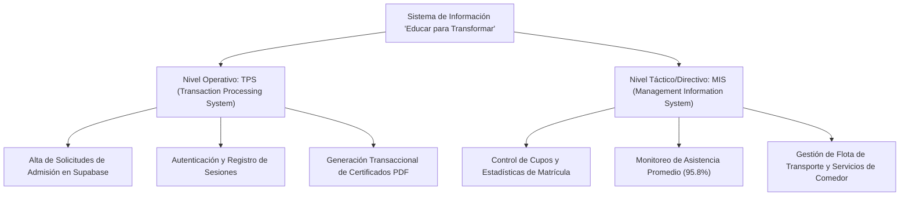
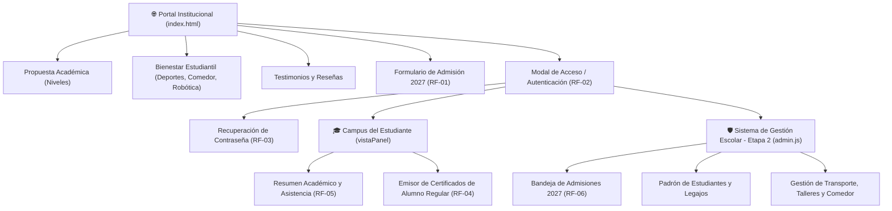
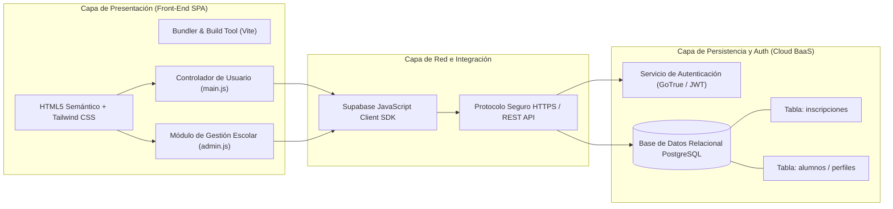
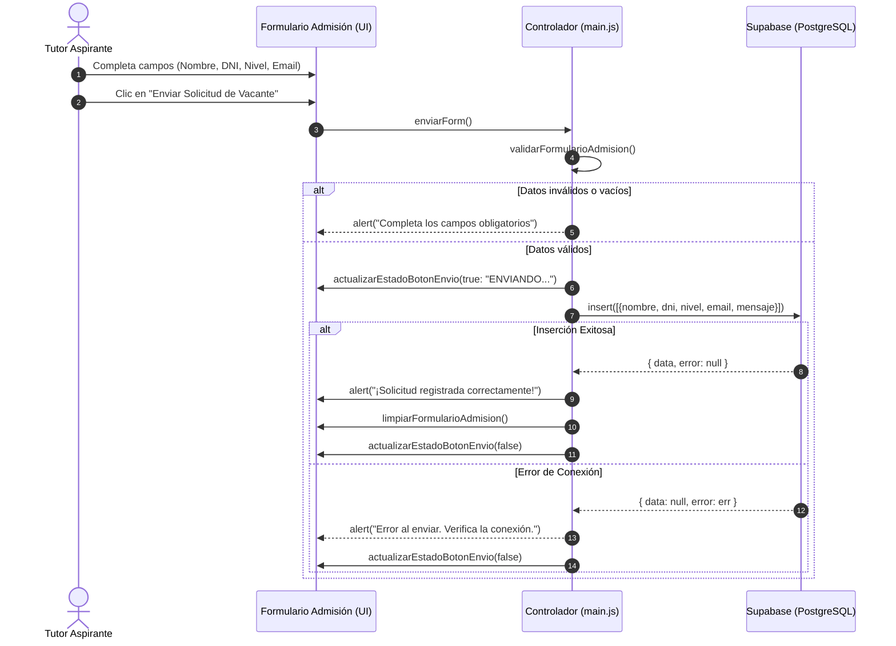
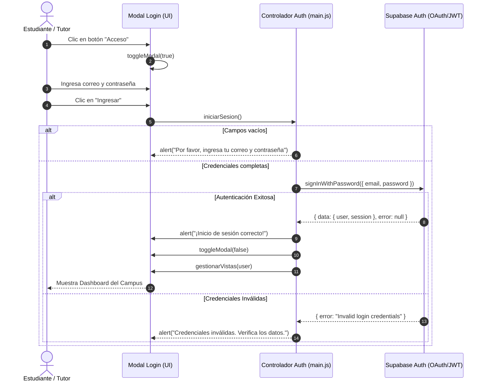
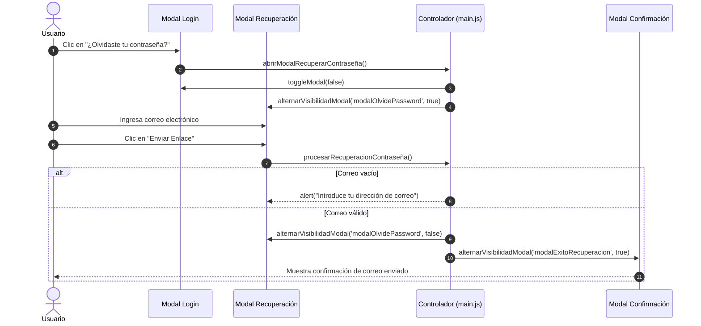
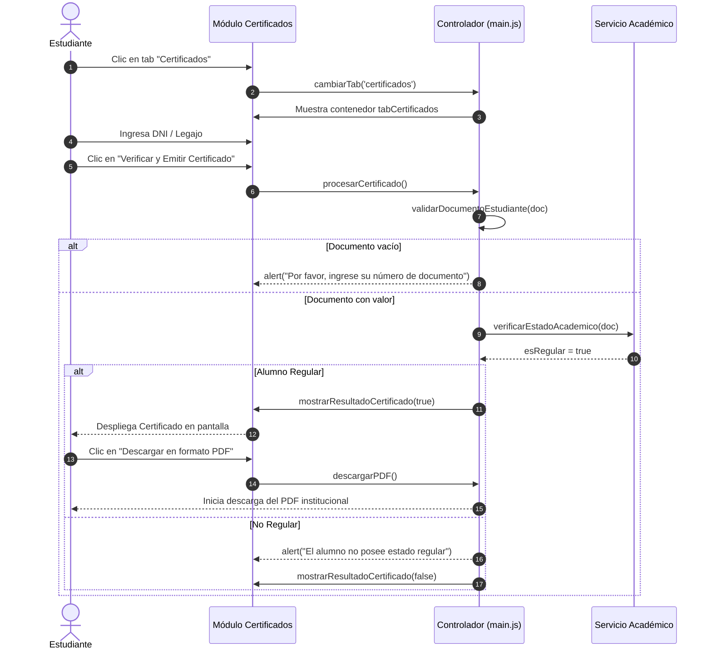
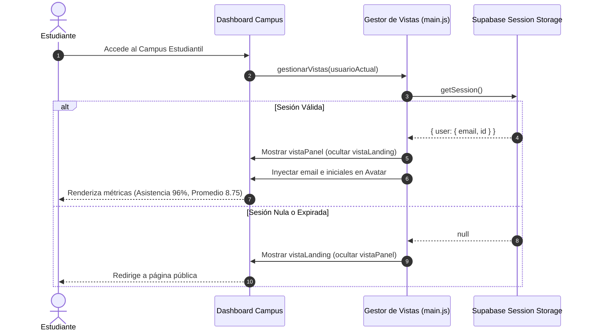
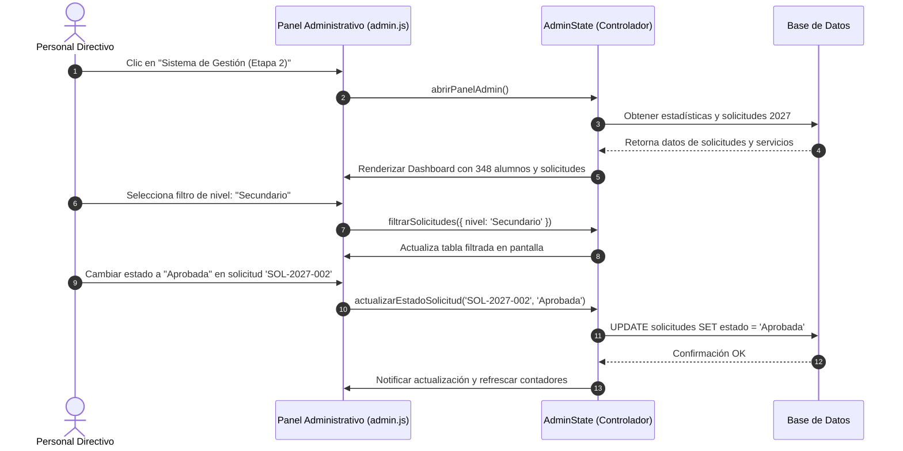

# 🎓 TRABAJO PRÁCTICO N° 1 — PARTE 1
## Metodología de Sistemas II — UTN FRRe

---

**Institución:** Universidad Tecnológica Nacional — Facultad Regional Resistencia  
**Cátedra:** Metodología de Sistemas II  
**Docente:** Ing. Carolina Vargas  
**Carrera:** Tecnicatura Universitaria en Programación (TUP)  
**Trabajo Práctico:** Trabajo Práctico N° 1 — Parte 1: Especificación de Requerimientos y Diseño Arquitectónico  
**Proyecto:** Sistema de Gestión Escolar y Portal Institucional *"Educar para Transformar"*  
**Integrantes del Equipo (2 miembros):**
1. **Gustavo Vernengo**
2. **Mateo Bosch Vesconi**

**Fecha de Entrega:** Septiembre 2026  
**Repositorio Oficial del Proyecto:** `https://github.com/gusvernengo/educar-para-tranformar-2`  

---

## 📑 ÍNDICE GENERAL

1. [Introducción y Objetivos Organizacionales](#1-introducción-y-objetivos-organizacionales)
2. [Especificación de Funcionalidades (Teoría de Requerimientos)](#2-especificación-de-funcionalidades-teoría-de-requerimientos)
   - 2.1. Requerimientos Funcionales (RF)
   - 2.2. Requerimientos No Funcionales (RNF)
3. [Clasificación del Sistema de Información](#3-clasificación-del-sistema-de-información)
4. [Arquitectura de la Información y Arquitectura de Software](#4-arquitectura-de-la-información-y-arquitectura-de-software)
   - 4.1. Arquitectura de la Información (AI)
   - 4.2. Arquitectura de Software (AS) y Modelo Tecnológico
5. [Artefactos por Integrante: Historias de Usuario, Casos de Uso y Diagramas de Secuencia](#5-artefactos-por-integrante)
   - **5.1. Integrante 1: Gustavo Vernengo**
     - RF-01: Proceso de Admisión y Registro de Solicitud de Vacante
     - RF-02: Autenticación de Usuarios y Control de Acceso al Campus
     - RF-03: Recuperación Segura de Contraseña
   - **5.2. Integrante 2: Mateo Bosch Vesconi**
     - RF-04: Verificación Académica y Emisión de Certificado de Alumno Regular
     - RF-05: Visualización de Dashboard de Asistencia y Progreso Académico
     - RF-06: Gestión Administrativa y Asignación de Servicios Institucionales (Etapa 2)
6. [Conclusiones del Trabajo](#6-conclusiones-del-trabajo)

---

## 1. Introducción y Objetivos Organizacionales

A fin de iniciar formalmente el proceso de análisis y desarrollo del nuevo sistema de gestión para el centro educativo **"Educar para Transformar"** (Resistencia, Chaco), la Dirección de la institución solicitó la conformación de los equipos técnicos de trabajo y la definición de las bases metodológicas del proyecto.

### 🎯 Objetivos Organizacionales de la Institución
1. **Modernización de la Atención a las Familias:** Disminuir los tiempos de espera y trámites presenciales mediante la digitalización del proceso de solicitud de vacantes e inscripciones 2027 para los niveles Inicial, Primario y Secundario.
2. **Autonomía y Autogestión Estudiantil:** Proveer a los alumnos regulares y sus tutores un portal web accesible las 24 horas para consultar información de asistencia, circulares y tramitar constancias de alumno regular de forma automática e inmediata con validación institucional.
3. **Optimización de la Gestión Administrativa Escolar:** Proporcionar al personal directivo y de secretaría un sistema centralizado para administrar solicitudes de aspirantes, matrícula activa, asignación de rutas de transporte escolar, servicios de comedor y actividades extracurriculares de robótica y deportes.
4. **Seguridad, Trazabilidad e Integridad de la Información:** Erradicar la pérdida de documentos en papel mediante una base de datos relacional en la nube protegida con políticas de autenticación y respaldo constante.

---

## 2. Especificación de Funcionalidades (Teoría de Requerimientos)

Aplicando la **Teoría de Requerimientos de la Ingeniería de Software**, las necesidades de los usuarios y de la institución se formalizan en requerimientos funcionales (lo que el sistema debe hacer) y requerimientos no funcionales (las restricciones y calidades bajo las cuales debe operar).

### 2.1. Requerimientos Funcionales (RF)

| Código | Nombre del Requerimiento | Descripción | Prioridad |
| :---: | :--- | :--- | :---: |
| **RF-01** | **Registro de Solicitud de Admisión 2027** | El sistema debe permitir a tutores aspirantes completar un formulario web (nombre, DNI, nivel de interés, email y consulta) y registrarlo de manera persistente en la base de datos institucional. | **Alta** |
| **RF-02** | **Autenticación y Control de Sesión** | El sistema debe proveer autenticación segura mediante credenciales (email y contraseña) validando los permisos del usuario con Supabase Auth y manteniendo la sesión persistente. | **Alta** |
| **RF-03** | **Recuperación de Contraseña** | El sistema debe posibilitar la solicitud de restablecimiento de contraseña ante olvido, validando la existencia del correo registrado y emitiendo el enlace seguro correspondiente. | **Media** |
| **RF-04** | **Emisión de Certificado de Alumno Regular** | El sistema debe validar el documento o legajo del estudiante en su estado académico y generar en pantalla la constancia oficial de alumno regular con firma institucional y opción de descarga en PDF. | **Alta** |
| **RF-05** | **Dashboard Académico y de Asistencia** | El sistema debe presentar al estudiante logueado un resumen visual de su estado: promedio de calificaciones, porcentaje de asistencia (ej. 96%), asignaturas activas y avisos institucionales. | **Media** |
| **RF-06** | **Administración de Vacantes y Servicios Escolares** | El sistema debe permitir al personal administrativo consultar, filtrar por nivel y actualizar el estado de las solicitudes de ingreso (Pendiente, En Revisión, Aprobada), así como gestionar servicios de micro escolar, comedor y talleres. | **Alta** |

### 2.2. Requerimientos No Funcionales (RNF)

| Código | Tipo / Categoría | Descripción y Métrica |
| :---: | :--- | :--- |
| **RNF-01** | **Rendimiento (Performance)** | Las consultas a la base de datos y la carga inicial de vistas no deben superar los 1.5 segundos en conexiones de banda ancha estándar. |
| **RNF-02** | **Seguridad** | Las contraseñas deben cifrarse en tránsito y en reposo mediante protocolos SSL/TLS y algoritmos de hash seguros provistos por Supabase. |
| **RNF-03** | **Usabilidad y Accesibilidad** | La interfaz debe ser responsive (adaptable a dispositivos móviles, tablets y monitores de escritorio) construida con Tailwind CSS y tipografía legible. |
| **RNF-04** | **Disponibilidad** | El sistema debe operar con un uptime de al menos el 99.5% alojado en infraestructura Cloud basada en PostgreSQL. |
| **RNF-05** | **Modularidad y Mantenibilidad** | El código fuente debe estar desacoplado en módulos ES6 gestionados con el bundler Vite (`main.js`, `admin.js`, `style.css`), siguiendo buenas prácticas de Clean Code. |

---

## 3. Clasificación del Sistema de Información

De acuerdo con la teoría clásica de los Sistemas de Información (Laudon & Laudon) y las funcionalidades relevadas, la solución tecnológica se clasifica en dos dimensiones complementarias:

1. **Nivel Operativo — Sistema de Procesamiento de Transacciones (TPS - Transaction Processing System):**
   - Ejecuta y almacena las transacciones rutinarias diarias del centro educativo: ingreso de solicitudes de vacantes por parte de padres, validación y expedición inmediata de certificados académicos a estudiantes y autenticación de usuarios.
2. **Nivel Táctico / Administrativo — Sistema de Información Gerencial (MIS - Management Information System):**
   - Provee a la Dirección y Coordinación paneles de control con indicadores clave de rendimiento (KPIs): volumen de aspirantes por nivel educativo, índice de asistencia institucional global, estado de ocupación de las rutas de micro escolar y estado de legajos, facilitando la toma de decisiones para el ciclo lectivo 2027.

---

## 4. Arquitectura de la Información y Arquitectura de Software

### 4.1. Arquitectura de la Información (AI)

La estructura jerárquica de la información organiza el contenido en dos grandes entornos lógicos: el **Espacio Institucional Público** (orientado a la captación y servicios comunitarios) y el **Espacio Privado / Autogestión** (restringido por credenciales):

### 4.2. Arquitectura de Software (AS) y Modelo Tecnológico

El sistema implementa una **Arquitectura en Capas Basada en Servicios (Client-Side SPA + Backend as a Service - BaaS)**, asegurando escalabilidad, alta disponibilidad y bajo costo operativo:

* **Front-End:** Interfaz web ligera reactiva basada en estándares web modernos (Vanilla JS ES6 modular) empaquetada con **Vite**.
* **Back-End & Persistencia:** **Supabase Cloud**, proveyendo base de datos PostgreSQL, APIs REST automáticas con políticas de seguridad a nivel de fila (RLS) y autenticación basada en JSON Web Tokens (JWT).

---

## 5. Artefactos por Integrante

Cada integrante del equipo seleccionó **tres requerimientos funcionales** y desarrolló para cada uno:
1. La **Historia de Usuario** (según plantilla oficial de la cátedra).
2. El **Caso de Uso** (según plantilla formal de la cátedra con flujos normales y alternativos).
3. El **Diagrama de Secuencia UML** correspondiente.

---

### 5.1. INTEGRANTE 1: Gustavo Vernengo

---

#### 📌 REQUERIMIENTO 1 (RF-01): Proceso de Admisión y Registro de Solicitud de Vacante

##### A. Historia de Usuario

| Campo | Detalle |
| :--- | :--- |
| **Número:** 1 | **Usuario:** Tutor / Padre Aspirante |
| **Nombre historia:** | Registro online de solicitud de admisión escolar 2027 |
| **Prioridad en negocio:** Alta | **Riesgo en desarrollo:** Bajo |
| **Puntos estimados:** 3 | **Iteración asignada:** 1 |
| **Programador responsable:** | Gustavo Vernengo |
| **Descripción:** | **Como** tutor de un aspirante a ingresar al colegio, **quiero** completar y enviar el formulario de admisión de forma digital desde el sitio web, **para que** la institución registre mis datos de contacto y el nivel educativo de interés sin tener que acudir presencialmente. |
| **Validación:** | El tutor puede ingresar nombre, DNI, nivel, correo y mensaje. Al presionar el botón de envío, el sistema valida que los campos no estén vacíos, almacena el registro en Supabase y muestra un mensaje de confirmación en pantalla. |

##### B. Caso de Uso: Registrar Solicitud de Admisión

| Campo | Detalle |
| :--- | :--- |
| **Nombre:** | Registrar Solicitud de Admisión |
| **Autor:** | Gustavo Vernengo |
| **Fecha:** | 2026-09-28 |
| **Prioridad:** | Alta (1) |
| **Descripción:** | Permite a un tutor postulante registrar una solicitud de vacante para el ciclo lectivo 2027 con persistencia directa en la base de datos. |
| **Actores:** | Tutor Aspirante |
| **Precondiciones:** | El usuario debe tener acceso al sitio web y contar con conexión a internet. |
| **Flujo Normal:** | 1.- El actor navega hasta la sección de "Contacto / Proceso de Admisión 2027". 2.- El sistema presenta el formulario con los campos: Nombre completo, DNI, Nivel de interés, Correo del tutor y Mensaje adicional. 3.- El actor completa los datos requeridos y presiona el botón "Enviar Solicitud de Vacante". 4.- El sistema valida que los campos obligatorios (Nombre, DNI, Correo) contengan información válida. 5.- El sistema actualiza el estado del botón a "ENVIANDO..." y lo deshabilita temporalmente. 6.- El sistema envía los datos de manera asincrónica a la tabla `inscripciones` de la base de datos Supabase. 7.- La base de datos almacena el registro y retorna confirmación satisfactoria (código 201). 8.- El sistema notifica al actor: "¡Solicitud registrada correctamente en la base de datos!", restablece el botón y limpia los campos del formulario. |
| **Flujo Alternativo:** | **4.A - Campos obligatorios incompletos o vacíos:** 1. El sistema detecta que el nombre, DNI o correo no fueron ingresados. 2. El sistema muestra una alerta: "Por favor, completa los campos obligatorios (Nombre, DNI, Email)". 3. Se cancela el envío a la base de datos y se mantiene el foco en el formulario.  **7.B - Falla de red o error en la base de datos:** 1. La base de datos responde con error o se agota el tiempo de espera (timeout). 2. El sistema captura la excepción y muestra: "Error al enviar. Verifica la conexión y reintenta.". 3. El sistema rehabilita el botón sin borrar los datos para que el usuario pueda reintentar. |
| **Poscondiciones:** | La solicitud de admisión queda almacenada en estado "Pendiente" en la base de datos para su posterior evaluación. |

##### C. Diagrama de Secuencia: Registrar Solicitud de Admisión

---

#### 📌 REQUERIMIENTO 2 (RF-02): Autenticación de Usuarios y Control de Acceso al Campus

##### A. Historia de Usuario

| Campo | Detalle |
| :--- | :--- |
| **Número:** 2 | **Usuario:** Estudiante / Tutor Registrado |
| **Nombre historia:** | Inicio de sesión seguro al Campus Estudiantil |
| **Prioridad en negocio:** Alta | **Riesgo en desarrollo:** Medio |
| **Puntos estimados:** 5 | **Iteración asignada:** 1 |
| **Programador responsable:** | Gustavo Vernengo |
| **Descripción:** | **Como** estudiante o tutor perteneciente a la institución, **quiero** ingresar con mi correo y contraseña al sistema, **para que** se habilite mi panel privado y pueda consultar mi información académica protegida. |
| **Validación:** | El usuario ingresa sus credenciales en el modal de login. Si son válidas, se oculta la landing pública, se abre la vista del Campus con su correo en el perfil y se guarda la sesión activa en el navegador. |

##### B. Caso de Uso: Iniciar Sesión en el Campus

| Campo | Detalle |
| :--- | :--- |
| **Nombre:** | Iniciar Sesión en el Campus |
| **Autor:** | Gustavo Vernengo |
| **Fecha:** | 2026-09-28 |
| **Prioridad:** | Alta (1) |
| **Descripción:** | Autentica al usuario contra el servicio central de autenticación y carga su panel correspondiente. |
| **Actores:** | Estudiante / Tutor |
| **Precondiciones:** | El usuario debe estar previamente registrado en el sistema. |
| **Flujo Normal:** | 1.- El actor hace clic en el botón "Acceso" del menú principal. 2.- El sistema despliega el modal emergente con los campos de correo y contraseña. 3.- El actor ingresa sus credenciales válidas y hace clic en "Ingresar". 4.- El sistema valida que los campos no estén vacíos. 5.- El sistema solicita la autenticación al servicio Supabase Auth (`signInWithPassword`). 6.- Supabase valida el hash de contraseña y devuelve el token JWT con la información del usuario. 7.- El sistema notifica: "¡Inicio de sesión correcto! Bienvenido al Campus.". 8.- El sistema cierra el modal, oculta la vista pública y renderiza el Dashboard estudiantil (`vistaPanel`) mostrando el avatar con iniciales y correo del usuario. |
| **Flujo Alternativo:** | **4.A - Campos de credenciales en blanco:** 1. El sistema advierte: "Por favor, ingresa tu correo y contraseña." y mantiene el modal abierto.  **6.B - Credenciales incorrectas:** 1. Supabase rechaza la petición con "Invalid login credentials". 2. El sistema muestra la alerta: "Credenciales inválidas. Verifica el correo o la contraseña.". 3. Se limpian los campos erróneos y no se concede acceso al sistema. |
| **Poscondiciones:** | Se crea la sesión de usuario activa en `localStorage` permitiendo la persistencia ante recargas de página. |

##### C. Diagrama de Secuencia: Iniciar Sesión en el Campus

---

#### 📌 REQUERIMIENTO 3 (RF-03): Recuperación Segura de Contraseña

##### A. Historia de Usuario

| Campo | Detalle |
| :--- | :--- |
| **Número:** 3 | **Usuario:** Usuario del Sistema (Estudiante/Tutor) |
| **Nombre historia:** | Recuperación de credenciales por correo electrónico |
| **Prioridad en negocio:** Media | **Riesgo en desarrollo:** Bajo |
| **Puntos estimados:** 2 | **Iteración asignada:** 2 |
| **Programador responsable:** | Gustavo Vernengo |
| **Descripción:** | **Como** usuario que ha olvidado su clave de acceso al campus, **quiero** solicitar un enlace de restablecimiento ingresando mi correo registrado, **para que** pueda volver a acceder a mi cuenta sin requerir soporte presencial de secretaría. |
| **Validación:** | El usuario hace clic en "¿Olvidaste tu contraseña?", tipea su correo y envía la solicitud. El sistema comprueba el dato y confirma el envío del enlace de recuperación. |

##### B. Caso de Uso: Recuperar Contraseña de Acceso

| Campo | Detalle |
| :--- | :--- |
| **Nombre:** | Recuperar Contraseña de Acceso |
| **Autor:** | Gustavo Vernengo |
| **Fecha:** | 2026-09-28 |
| **Prioridad:** | Media (3) |
| **Descripción:** | Gestiona la solicitud de reseteo de credenciales de acceso para usuarios que no recuerdan su contraseña. |
| **Actores:** | Usuario (Estudiante / Tutor) |
| **Precondiciones:** | El usuario debe estar en el modal de inicio de sesión. |
| **Flujo Normal:** | 1.- El actor pulsa sobre el enlace "¿Olvidaste tu contraseña?". 2.- El sistema oculta el modal de login y presenta el modal de recuperación de contraseña. 3.- El actor ingresa su dirección de correo electrónico institucional. 4.- El actor hace clic en "Enviar Enlace de Recuperación". 5.- El sistema valida que el campo de correo contenga texto y formato válido. 6.- El sistema procesa la solicitud y despliega el modal de confirmación exitosa informando que se ha despachado el enlace seguro a su casilla de correo. |
| **Flujo Alternativo:** | **5.A - Campo de correo vacío:** 1. El sistema detecta la ausencia de entrada de texto. 2. Muestra un mensaje: "Por favor, introduce tu dirección de correo electrónico.". 3. Mantiene al actor en la ventana actual para su corrección. |
| **Poscondiciones:** | Se emite la directiva de reseteo para que el usuario defina una nueva contraseña segura. |

##### C. Diagrama de Secuencia: Recuperar Contraseña

---

### 5.2. INTEGRANTE 2: Mateo Bosch Vesconi

---

#### 📌 REQUERIMIENTO 4 (RF-04): Verificación Académica y Emisión de Certificado de Alumno Regular

##### A. Historia de Usuario

| Campo | Detalle |
| :--- | :--- |
| **Número:** 4 | **Usuario:** Estudiante Autenticado |
| **Nombre historia:** | Autogestión y descarga de Certificado de Alumno Regular |
| **Prioridad en negocio:** Alta | **Riesgo en desarrollo:** Bajo |
| **Puntos estimados:** 3 | **Iteración asignada:** 1 |
| **Programador responsable:** | Mateo Bosch Vesconi |
| **Descripción:** | **Como** estudiante regular del colegio, **quiero** ingresar mi número de documento o legajo en el módulo de certificados, **para que** el sistema valide mi condición académica y genere mi constancia oficial en formato digital descargable en PDF. |
| **Validación:** | El estudiante ingresa a la pestaña "Certificados", tipea su DNI válido y pulsa "Verificar y Emitir". El sistema valida que se encuentre en condición regular y despliega el documento con firma y código de verificación institucional. |

##### B. Caso de Uso: Emitir Certificado de Alumno Regular

| Campo | Detalle |
| :--- | :--- |
| **Nombre:** | Emitir Certificado de Alumno Regular |
| **Autor:** | Mateo Bosch Vesconi |
| **Fecha:** | 2026-09-28 |
| **Prioridad:** | Alta (1) |
| **Descripción:** | Permite verificar la condición de regularidad de un estudiante y generar su constancia académica con validez oficial. |
| **Actores:** | Estudiante |
| **Precondiciones:** | El estudiante debe haber iniciado sesión previamente en el Campus. |
| **Flujo Normal:** | 1.- El actor selecciona la pestaña "Certificados" en el menú de navegación del campus. 2.- El sistema muestra la interfaz de emisión con el campo "Número de Documento o Legajo". 3.- El actor ingresa su número de documento escolar y presiona el botón "Verificar y Emitir Certificado". 4.- El sistema valida que el campo de documento no esté vacío y contenga formato numérico. 5.- El sistema ejecuta la verificación de regularidad académica del estudiante. 6.- El sistema comprueba que el estado es regular. 7.- El sistema genera y hace visible el panel del certificado con la firma digital de la Dirección y sello institucional. 8.- El actor pulsa sobre el botón "Descargar en formato PDF". 9.- El sistema compila y dispara la descarga del documento firmado digitalmente. |
| **Flujo Alternativo:** | **4.A - Documento o legajo vacío:** 1. El sistema advierte: "Por favor, ingrese su número de documento o legajo.". 2. Se cancela la emisión del documento.  **6.B - Alumno no regular o con deuda administrativa:** 1. El sistema determina que el alumno posee condición irregular. 2. Se muestra mensaje: "Error: El alumno no posee estado regular. No se puede emitir certificado.". 3. Se mantiene oculto el contenedor del certificado. |
| **Poscondiciones:** | El certificado queda emitido con marca de tiempo y disponible para su impresión o descarga por el alumno. |

##### C. Diagrama de Secuencia: Emitir Certificado de Alumno Regular

---

#### 📌 REQUERIMIENTO 5 (RF-05): Visualización de Dashboard de Asistencia y Progreso Académico

##### A. Historia de Usuario

| Campo | Detalle |
| :--- | :--- |
| **Número:** 5 | **Usuario:** Estudiante / Tutor |
| **Nombre historia:** | Visualización del resumen académico y porcentaje de asistencia |
| **Prioridad en negocio:** Media | **Riesgo en desarrollo:** Bajo |
| **Puntos estimados:** 3 | **Iteración asignada:** 1 |
| **Programador responsable:** | Mateo Bosch Vesconi |
| **Descripción:** | **Como** estudiante o tutor de la institución, **quiero** visualizar en el dashboard central mis métricas de asistencia, promedio general y avisos escolares, **para que** pueda hacer un seguimiento diario de mi desempeño académico de manera consolidada. |
| **Validación:** | Al acceder al panel del alumno, la pantalla de inicio presenta automáticamente los indicadores del ciclo 2026: asistencia (96%), promedio general (8.75), lista de materias en curso y circulares recientes. |

##### B. Caso de Uso: Consultar Dashboard Académico

| Campo | Detalle |
| :--- | :--- |
| **Nombre:** | Consultar Dashboard Académico |
| **Autor:** | Mateo Bosch Vesconi |
| **Fecha:** | 2026-09-28 |
| **Prioridad:** | Media (3) |
| **Descripción:** | Despliega las estadísticas académicas, materias inscritas y novedades generales para el estudiante en sesión. |
| **Actores:** | Estudiante / Tutor |
| **Precondiciones:** | El usuario debe haber completado la autenticación en el sistema. |
| **Flujo Normal:** | 1.- El usuario inicia sesión o pulsa en la solapa "Inicio" del Campus Estudiantil. 2.- El sistema consulta el estado del usuario activo desde la sesión de Supabase. 3.- El sistema recupera los datos académicos asociados al perfil del estudiante. 4.- El sistema renderiza las tarjetas de KPIs: Promedio general, porcentaje de asistencia (96%) y materias activas. 5.- El sistema carga la sección de "Circulares y Avisos Importantes" con los comunicados institucionales emitidos por dirección. 6.- El actor visualiza la totalidad de su estado académico actualizado. |
| **Flujo Alternativo:** | **2.A - Sesión no encontrada o expirada:** 1. El sistema detecta la ausencia de token de autenticación válido. 2. Redirige al actor a la pantalla principal pública invitándolo a iniciar sesión nuevamente. |
| **Poscondiciones:** | La información permanece en pantalla sin alterar los registros de la base de datos. |

##### C. Diagrama de Secuencia: Consultar Dashboard Académico

---

#### 📌 REQUERIMIENTO 6 (RF-06): Gestión Administrativa y Asignación de Servicios Institucionales (Etapa 2)

##### A. Historia de Usuario

| Campo | Detalle |
| :--- | :--- |
| **Número:** 6 | **Usuario:** Personal de Dirección / Secretaría Escolar |
| **Nombre historia:** | Administración de solicitudes de vacantes y control de servicios escolares |
| **Prioridad en negocio:** Alta | **Riesgo en desarrollo:** Medio |
| **Puntos estimados:** 5 | **Iteración asignada:** 2 |
| **Programador responsable:** | Mateo Bosch Vesconi |
| **Descripción:** | **Como** directivo o personal administrativo del centro educativo, **quiero** acceder al módulo integral de gestión (Etapa 2), **para que** pueda revisar las solicitudes de aspirantes registradas, filtrar por nivel y gestionar la asignación de cupos de transporte y comedor. |
| **Validación:** | El personal directivo pulsa el acceso a "Sistema de Gestión (Etapa 2)", accede a la consola de administración (`admin.js`), visualiza la tabla de postulantes 2027 y puede filtrar por nivel escolar o actualizar estados de inscripción. |

##### B. Caso de Uso: Gestionar Solicitudes y Servicios Escolares

| Campo | Detalle |
| :--- | :--- |
| **Nombre:** | Gestionar Solicitudes y Servicios Escolares |
| **Autor:** | Mateo Bosch Vesconi |
| **Fecha:** | 2026-09-28 |
| **Prioridad:** | Alta (2) |
| **Descripción:** | Permite a la secretaría académica supervisar las admisiones recibidas desde la web y coordinar los servicios complementarios. |
| **Actores:** | Personal Directivo / Administrativo |
| **Precondiciones:** | El usuario debe contar con privilegios administrativos en el sistema. |
| **Flujo Normal:** | 1.- El actor ingresa al "Sistema de Gestión Escolar (Etapa 2)" desde el acceso seguro. 2.- El sistema carga el panel de control administrativo desplegando las estadísticas globales (Total alumnos: 348, Solicitudes pendientes: 4, Asistencia promedio: 95.8%). 3.- El actor selecciona el módulo "Solicitudes de Vacantes 2027". 4.- El sistema consulta la lista de postulantes registrados. 5.- El actor aplica un filtro por nivel escolar (ej. "Nivel Secundario"). 6.- El sistema actualiza la grilla mostrando los registros coincidentes. 7.- El actor selecciona una solicitud y modifica su estado de "Pendiente" a "Aprobada", asignándole ruta de micro escolar o turno. 8.- El sistema persiste la actualización y actualiza los contadores directivos. |
| **Flujo Alternativo:** | **5.A - Sin coincidencias en la búsqueda:** 1. El sistema informa: "No se encontraron solicitudes con los criterios seleccionados". 2. Permite limpiar los filtros para recuperar el listado global. |
| **Poscondiciones:** | El estado de la solicitud queda actualizado en la base de datos para la notificación al tutor. |

##### C. Diagrama de Secuencia: Gestionar Solicitudes y Servicios Escolares

---

## 6. Conclusiones del Trabajo

1. **Alineación con Objetivos Organizacionales:** El diseño e ingeniería de requerimientos plasmados en este trabajo práctico responden de manera directa a la necesidad planteada por la Dirección de *"Educar para Transformar"*, permitiendo integrar en un ecosistema unificado la atención pública a las familias, la autogestión de certificados de los alumnos y la gestión operativa administrativa.
2. **Aplicación Estricta de la Metodología:** Mediante la formalización en Historias de Usuario (con sus criterios de aceptación SMART) y Casos de Uso con flujos normales y alternativos, se garantiza una cobertura exhaustiva que previene ambigüedades en la fase de construcción.
3. **Robustez Arquitectónica y Modelado UML:** Los diagramas de secuencia modelan con claridad la interacción entre capas (Presentación en Vite, Lógica de Negocio y Base de Datos Supabase/PostgreSQL), sirviendo como referencia técnica directa para las etapas subsiguientes del ciclo de vida del software.
