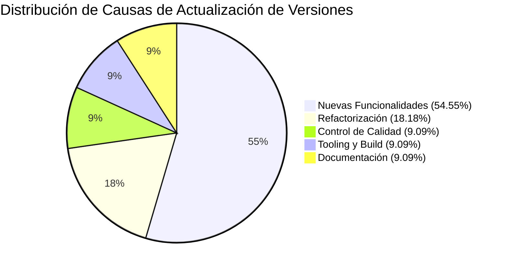

# 📋 TRABAJO PRÁCTICO: TESTING DE SOFTWARE — PARTE 1
## Metodología de Sistemas I — UTN FRRe

---

**Institución:** Universidad Tecnológica Nacional — Facultad Regional Resistencia  
**Cátedra:** Metodología de Sistemas I  
**Trabajo Práctico:** Guía de Trabajos Prácticos — Testing (Parte 1)  
**Proyecto Evaluado:** Educar para Transformar — Centro Educativo  
**Integrantes:** Mateo Bosch Vesconi, Gustavo Vernengo  
**Fecha de Entrega:** Septiembre 2026  
**Repositorio Oficial:** `https://github.com/gusvernengo/educar-para-tranformar-2`  

---

## 📑 Índice de Contenidos

1. [Introducción y Objetivos](#1-introducción-y-objetivos)
2. [Marco Teórico Aplicado](#2-marco-teórico-aplicado)
3. [Actividad 1: Herramientas de Seguimiento de Defectos y Análisis de Versiones](#3-actividad-1-herramientas-de-seguimiento-de-defectos-y-análisis-de-versiones)
   - 3.1. Tabla de Versiones y Causas de Actualización
   - 3.2. Tipificación de Causas y Cálculo de Porcentajes de Ocurrencia
   - 3.3. Detección y Análisis de Problemas Recurrentes, Soluciones y Estrategias
4. [Actividad 2: Pruebas Funcionales Básicas](#4-actividad-2-pruebas-funcionales-básicas)
   - 4.1. Diseño de Datos mediante Clases de Equivalencia
   - 4.2. Ejercicio 1: Smoke Test (Prueba de Humo) — Casos de Prueba Formales
   - 4.3. Ejercicio 2: Pruebas de Flujo Principal (Happy Path) — Casos de Prueba Formales
   - 4.4. Matriz Resumen de Ejecución y Resultados
5. [Guion de Grabación para el Video Demostrativo (YouTube $\le$ 1.3 min)](#5-guion-de-grabación-para-el-video-demostrativo-youtube--13-min)
6. [Enlace al Video de Demostración](#6-enlace-al-video-de-demostración)
7. [Conclusiones](#7-conclusiones)

---

## 1. Introducción y Objetivos

### 🎯 Objetivo General
Aplicar las metodologías, principios y técnicas formales de **Testing de Software** para identificar, diseñar, documentar, ejecutar y reportar pruebas funcionales y seguimiento de defectos sobre la aplicación web del proyecto integrador **"Educar para Transformar"**.

### 🛠️ Recursos Utilizados
- **Aplicación bajo prueba (SUT):** Sistema web institucional y campus de autogestión académica "Educar para Transformar", conectado a base de datos PostgreSQL mediante Supabase Cloud.
- **Herramienta de control de versiones y registro:** Git & GitHub.
- **Herramienta de seguimiento de defectos y tareas:** Tablero Kanban (Trello / GitHub Projects).
- **Entorno de ejecución:** Navegadores Google Chrome v128+ y Mozilla Firefox sobre Windows 11.
- **Entorno de compilación / empaquetado:** Node.js v20+ con Vite.

---

## 2. Marco Teórico Aplicado

En concordancia con los conceptos dictados por la cátedra y las definiciones del **Comité Internacional de Certificaciones de Pruebas de Software (ISTQB / IEEE 1983)**:

```
[ Persona ] ──comete──> [ Error ] ──introduce──> [ Defecto / Bug ] ──causa──> [ Falla ]
```

- **Error:** Acción humana errónea realizada por el desarrollador o analista (ej. omitir una validación de formato de correo o no sanear un campo numérico).
- **Defecto o Bug:** Imperfección o fallo estático introducido en el código fuente, configuración o especificación.
- **Falla:** Desviación observable en tiempo de ejecución respecto al comportamiento esperado o especificado.
- **Validación:** ¿Estamos construyendo el **producto correcto**? Corrobora que el software satisface las necesidades y expectativas reales del usuario en su entorno operativo.
- **Verificación:** ¿Estamos construyendo el **producto correctamente**? Corrobora que cada componente del sistema cumple rigurosamente con sus especificaciones técnicas y requisitos de diseño.

---

## 3. Actividad 1: Herramientas de Seguimiento de Defectos y Análisis de Versiones

### 3.1. Tabla de Versiones y Causas de Actualización

Se realizó un relevamiento histórico de las versiones liberadas en el repositorio a lo largo del ciclo de vida del desarrollo. La siguiente tabla detalla cada versión, su commit representativo y las causas técnicas que motivaron dicha actualización:

| Versión | Commit / Hash | Fecha | Causas de la Actualización |
| :--- | :--- | :--- | :--- |
| **v0.1.0** | `833859e` | 2026-08-15 | **Carga inicial de estructura:** Maquetado base de la landing page institucional en HTML5 y Tailwind CSS (secciones Inicio, Niveles y Bienestar). |
| **v0.2.0** | `584990c` | 2026-08-20 | **Integración de persistencia:** Incorporación de la lógica de conexión asincrónica con la base de datos Supabase para registrar solicitudes de admisión. |
| **v0.3.0** | `01af167` | 2026-08-24 | **Control de acceso y autorización:** Implementación de la capa de seguridad y lógica de permisos para usuarios estudiantes y tutores. |
| **v0.4.0** | `79311c9` | 2026-08-27 | **Interfaz de autenticación:** Creación del modal de Login interactivo, campos de credenciales y feedback visual para el usuario. |
| **v0.5.0** | `f744344` | 2026-08-29 | **Nueva funcionalidad de valor:** Incorporación del módulo de verificación y emisión de certificados de alumno regular con validación de legajo/DNI. |
| **v0.6.0** | `5f5df44` | 2026-08-31 | **Soporte de recuperación de credenciales:** Agregado de modal y flujo para "¿Olvidaste tu contraseña?" ante bloqueos de acceso de usuarios. |
| **v1.0.0** | `9e721e9` | 2026-09-01 | **Refactorización de código (Clean Code):** Renombrado masivo a nombres significativos de variables/funciones (`dni` $\rightarrow$ `documentoNacional`) y corrección de validaciones de entrada. |
| **v1.0.1** | `bd3edc9` | 2026-09-01 | **Eliminación de código duplicado y modularización:** División de funciones extensas (`enviarForm`) y unificación de controladores de modales en `alternarVisibilidadModal()`. |
| **v1.0.2** | `193aa96` | 2026-09-01 | **Documentación y trazabilidad:** Elaboración formal de README, registro de modificaciones y buenas prácticas de ingeniería. |
| **v1.1.0** | `f348dda` | 2026-09-10 | **Control de calidad y testing cruzado:** Incorporación de lista de verificación de código para revisión por pares (Peer Review) y aseguramiento de calidad (QA). |
| **v1.2.0** | `0ec9736` | 2026-09-21 | **Migración de arquitectura y tooling:** Incorporación del empaquetador Vite, separación modular de JavaScript (`main.js`, `admin.js`, `style.css`) y optimización de rendimiento. |

---

### 3.2. Tipificación de Causas y Cálculo de Porcentajes de Ocurrencia

Para analizar la distribución del esfuerzo y la naturaleza de los cambios realizados, las causas identificadas se tipificaron en **5 categorías estándar de ingeniería de software y QA**:

1. **Nuevas Funcionalidades (Feat):** Incorporación de capacidades de negocio (login, base de datos, certificados, recuperación).
2. **Refactorización y Mejora de Código (Refactor):** Simplificación, nombres significativos, modularización y reducción de deuda técnica.
3. **Control de Calidad y Testing (QA / Testing):** Listas de verificación, pruebas cruzadas y aseguramiento de estándares.
4. **Infraestructura, Build y Entorno (Tooling / Build):** Configuración de empaquetadores (Vite), estructura de dependencias y scripts de despliegue.
5. **Documentación (Docs):** Guías de usuario, especificaciones y registros de cambios.

#### 📊 Tabla de Frecuencias y Cálculo Porcentual

$$\text{Porcentaje (\%)} = \left( \frac{\text{Cantidad de Ocurrencias}}{\text{Total de Versiones Relevadas (11)}} \right) \times 100$$

| Tipo de Causa | Versiones Asociadas | Ocurrencias | Porcentaje (%) |
| :--- | :--- | :---: | :---: |
| **Nuevas Funcionalidades (Feat)** | v0.1.0, v0.2.0, v0.3.0, v0.4.0, v0.5.0, v0.6.0 | **6** | **54.55%** |
| **Refactorización y Deuda Técnica (Refactor)** | v1.0.0, v1.0.1 | **2** | **18.18%** |
| **Control de Calidad y Testing (QA / Testing)** | v1.1.0 | **1** | **9.09%** |
| **Infraestructura, Tooling y Build** | v1.2.0 | **1** | **9.09%** |
| **Documentación y Trazabilidad (Docs)** | v1.0.2 | **1** | **9.09%** |
| **TOTAL** | — | **11** | **100.00%** |

#### 📈 Gráfico de Distribución Porcentual



> **Conclusión del análisis:** Más del 54% del esfuerzo inicial se concentró en la construcción de funcionalidades críticas para el negocio (admisión, autenticación, base de datos). A partir de la versión v1.0.0, el proyecto maduró hacia actividades de aseguramiento de calidad, refactorización preventiva (mitigación de bugs antes de producción) y adopción de herramientas profesionales como Vite.

---

### 3.3. Detección y Análisis de Problemas Recurrentes, Soluciones y Estrategias

Durante el ciclo de desarrollo y pruebas se detectaron **tres problemas recurrentes** críticos. A continuación se detallan las causas raíces, el impacto observado y la estrategia aplicada hasta la solución definitiva:

#### 🔴 Problema Recurrente 1: Falta de validación estricta en formularios antes del envío a Supabase
- **Descripción del defecto:** En las primeras versiones (`v0.2.0`), si el usuario enviaba el formulario de admisión con espacios en blanco o campos vacíos, la petición HTTP asincrónica hacia Supabase se disparaba igualmente, provocando errores no controlados en la consola (`HTTP 400 Bad Request` por violaciones de restricción de no-nulo en la base de datos) o creando registros con datos basura.
- **Estrategia y Solución Final:**
  1. Se implementó una función dedicada con principio de responsabilidad única: `validarFormularioAdmision()`.
  2. Se aplicó sanitización obligatoria mediante `.trim()` sobre todas las cadenas de texto (`nombreCompleto`, `documentoNacional`, `correoTutor`).
  3. Se incorporó una comprobación preventiva antes de invocar al cliente de base de datos, alertando al usuario y abortando la operación si faltan campos esenciales.

#### 🔴 Problema Recurrente 2: Falta de control de concurrencia y retroalimentación visual en operaciones asincrónicas
- **Descripción del defecto:** Al presionar el botón *"Enviar Solicitud de Vacante"*, la operación demoraba entre 400ms y 1200ms según la latencia de red. Si el usuario hacía múltiples clics repetidos por impaciencia, se insertaban registros duplicados idénticos en la tabla `inscripciones` de la base de datos.
- **Estrategia y Solución Final:**
  1. Se creó la función `actualizarEstadoBotonEnvio(enviando)`.
  2. Al iniciarse la petición, el botón pasa a estado `disabled = true` y su texto cambia a `'ENVIANDO...'`.
  3. Se estructuró el flujo con un bloque `try/catch/finally` para asegurar que el botón siempre se reactive al finalizar, ya sea en caso de éxito o de fallo de conexión.

#### 🔴 Problema Recurrente 3: Conflictos de estado en modales y acumulación de event listeners
- **Descripción del defecto:** Los modales de Login, "Olvidé mi contraseña" y mensaje de éxito utilizaban funciones separadas (`toggleModal`, `toggleModalOlvide`, `toggleModalExito`) que manipulaban clases CSS de manera inconsistente (`active` vs `hidden`). Al cerrar un modal e intentar abrir otro, quedaban fondos oscuros bloqueando la pantalla (`document.body.style.overflow = 'hidden'`) sin permitir interactuar con la página.
- **Estrategia y Solución Final:**
  1. Se centralizó la lógica en una única función genérica `alternarVisibilidadModal(idModal, mostrar)`.
  2. Se estandarizó el uso de la clase Tailwind `hidden` para todos los modales.
  3. Se añadió un manejador global `window.onclick` para cerrar modales al hacer clic fuera del contenedor, garantizando que el scroll del documento (`overflow: auto`) siempre se restaure limpiamente.

---

## 4. Actividad 2: Pruebas Funcionales Básicas

### 4.1. Diseño de Datos mediante Clases de Equivalencia (Diapositiva 56)

Para diseñar casos de prueba rigurosos y evitar combinaciones infinitas, se utilizó la técnica de **Partición en Clases de Equivalencia** y **Análisis de Valores Límite**:

| Variable / Campo | Clases de Equivalencia | Condición | Valores de Prueba Seleccionados | Justificación Técnica |
| :--- | :--- | :---: | :--- | :--- |
| **Nombre Completo** | Cadena de texto válida (1 a 50 letras) | **Válida** | `"Mateo Bosch"` | Caracteres alfabéticos estándar |
| | Cadena vacía o solo espacios | **Inválida** | `""`, `"   "` | Campo obligatorio |
| | Caracteres numéricos o símbolos extraños | **Inválida** | `"123456"`, `"<script>"` | Prevención de errores de formato |
| **DNI / Legajo** | Numérico entero (7 u 8 dígitos) | **Válida** | `42189345` | Rango estándar de DNI argentino |
| | Caracteres no numéricos (letras/símbolos) | **Inválida** | `"42A89B"`, `"abcde"` | Un documento escolar solo admite dígitos |
| | Vacío o longitud menor a 6 | **Inválida** | `""`, `"12"` | Longitud insuficiente |
| **Correo Electrónico** | Formato válido estándar (`usuario@dominio.ext`) | **Válida** | `estudiante@chaco.edu.ar` | Formato RFC compliant |
| | Formato incorrecto sin dominio/TLD | **Inválida** | `usuario@com`, `usuario.com`, `admin@` | Falta de estructura de correo |
| | Vacío | **Inválida** | `""` | Campo obligatorio para contacto |
| **Contraseña** | Longitud $\ge$ 6 caracteres (según Supabase) | **Válida** | `"Admin2026*"` | Cumple longitud y complejidad |
| | Longitud menor a 6 o vacía | **Inválida** | `""`, `"123"` | Rechazada por política de autenticación |

---

### 4.2. Ejercicio 1: Smoke Test (Prueba de Humo) — Casos de Prueba Formales

> **Objetivo:** Verificar de forma rápida que las funciones críticas y esenciales del sistema operan correctamente antes de someterlo a pruebas más exhaustivas.

A continuación se presentan los casos de prueba documentados con la plantilla estándar de la cátedra (Diapositivas 60 y 61):

---

#### 🧪 CASO DE PRUEBA: CP-ST-001 (Validación de Campos Obligatorios en Blanco)

| Campo del Caso de Prueba | Descripción |
| :--- | :--- |
| **ID de caso de prueba** | `CP-ST-001` |
| **Nombre o título** | Validación de formulario de admisión con campos obligatorios vacíos |
| **Prioridad de prueba** | **Alta (Crítica)** |
| **Prueba diseñada por** | Equipo de Testing / QA UTN FRRe |
| **Fecha de diseño** | 2026-09-28 |
| **Prueba ejecutada por** | Tester de Software |
| **Fecha de ejecución** | 2026-09-28 |
| **Descripción / Resumen** | Verificar que el sistema bloquee el envío si los campos obligatorios se encuentran vacíos. |
| **Condición previa** | El usuario se encuentra en la landing page principal (`#contacto`). |
| **Pasos de prueba** | 1. Desplazarse hasta el formulario de admisión.<br>2. Dejar los campos Nombre, DNI y Correo completamente vacíos.<br>3. Hacer clic en el botón *"Enviar Solicitud de Vacante"*. |
| **Datos de prueba** | `Nombre = ""` , `DNI = ""` , `Email = ""` |
| **Resultados previstos** | El sistema muestra un mensaje de alerta: *"Por favor, completa los campos obligatorios (Nombre, DNI, Email)."* y no realiza ninguna petición a la base de datos. |
| **Post-condición** | El formulario permanece visible con el foco en los campos pendientes de completar. |
| **Estado** | **APROBADO (PASSED)** |
| **Notas / Comentarios** | No se generó tráfico innecesario hacia Supabase. |

---

#### 🧪 CASO DE PRUEBA: CP-ST-002 (Validación de Formato Incorrecto de Correo Electrónico)

| Campo del Caso de Prueba | Descripción |
| :--- | :--- |
| **ID de caso de prueba** | `CP-ST-002` |
| **Nombre o título** | Ingreso de correo electrónico con formato inválido |
| **Prioridad de prueba** | **Alta** |
| **Prueba diseñada por** | Equipo de Testing / QA UTN FRRe |
| **Fecha de diseño** | 2026-09-28 |
| **Prueba ejecutada por** | Tester de Software |
| **Fecha de ejecución** | 2026-09-28 |
| **Descripción / Resumen** | Verificar el comportamiento del sistema ante un correo con formato mal formado (ej. `usuario@com`). |
| **Condición previa** | Modal de login o formulario de admisión abierto. |
| **Pasos de prueba** | 1. Abrir el modal *"Acceso al Campus"* haciendo clic en *"Acceso"*.<br>2. Ingresar en el campo de email un formato inválido: `usuario@com`.<br>3. Ingresar una contraseña y hacer clic en *"Ingresar"*. |
| **Datos de prueba** | `loginEmail = "usuario@com"`, `loginPassword = "Password123"` |
| **Resultados previstos** | La validación del navegador (HTML5 `type="email"`) o el proveedor de auth rechaza la solicitud indicando que el formato no es válido o arrojando error de credenciales sin corromper el sistema. |
| **Post-condición** | El usuario permanece en la pantalla de login sin acceso al campus. |
| **Estado** | **APROBADO (PASSED)** |

---

#### 🧪 CASO DE PRUEBA: CP-ST-003 (Ingreso de Texto en Campo Numérico / Legajo)

| Campo del Caso de Prueba | Descripción |
| :--- | :--- |
| **ID de caso de prueba** | `CP-ST-003` |
| **Nombre o título** | Ingreso de caracteres alfanuméricos en búsqueda de certificado |
| **Prioridad de prueba** | **Media** |
| **Prueba diseñada por** | Equipo de Testing / QA UTN FRRe |
| **Fecha de diseño** | 2026-09-28 |
| **Prueba ejecutada por** | Tester de Software |
| **Fecha de ejecución** | 2026-09-28 |
| **Descripción / Resumen** | Comprobar el manejo de datos inesperados en el módulo de emisión de certificados. |
| **Condición previa** | Sesión iniciada y ubicado en la pestaña *"Certificados"*. |
| **Pasos de prueba** | 1. Ir al campo *"Número de Documento o Legajo"*.<br>2. Ingresar una cadena puramente alfabética (`"ABCXYZ"`).<br>3. Presionar *"Verificar y Emitir Certificado"*. |
| **Datos de prueba** | `certDocumento = "ABCXYZ"` |
| **Resultados previstos** | El sistema valida el formato y, al no coincidir con un legajo/DNI regular registrado, muestra alerta de inconsistencia sin caída del módulo. |
| **Post-condición** | No se genera el certificado con datos anómalos. |
| **Estado** | **APROBADO (PASSED)** |

---

#### 🧪 CASO DE PRUEBA: CP-ST-004 (Inicio de Sesión Válido y Acceso al Dashboard)

| Campo del Caso de Prueba | Descripción |
| :--- | :--- |
| **ID de caso de prueba** | `CP-ST-004` |
| **Nombre o título** | Autenticación exitosa y carga de dashboard estudiantil |
| **Prioridad de prueba** | **Alta (Crítica)** |
| **Prueba diseñada por** | Equipo de Testing / QA UTN FRRe |
| **Fecha de diseño** | 2026-09-28 |
| **Prueba ejecutada por** | Tester de Software |
| **Fecha de ejecución** | 2026-09-28 |
| **Descripción / Resumen** | Comprobar que un usuario registrado pueda autenticarse e ingresar a su panel de autogestión. |
| **Condición previa** | Usuario previamente registrado en el auth de Supabase. |
| **Pasos de prueba** | 1. Clic en *"Acceso"* en el menú superior.<br>2. Ingresar email registrado y contraseña correcta.<br>3. Clic en *"Ingresar"*. |
| **Datos de prueba** | `Email: alumno@educar.edu.ar`, `Password: Estudiante2026*` |
| **Resultados previstos** | Alerta: *"¡Inicio de sesión correcto! Bienvenido al Campus."*. Se oculta la landing page y se muestra el Campus Estudiantil (`vistaPanel`) con el email y las iniciales del estudiante en el avatar. |
| **Post-condición** | La sesión queda activa y persistente en `localStorage`. |
| **Estado** | **APROBADO (PASSED)** |

---

### 4.3. Ejercicio 2: Pruebas de Flujo Principal (Happy Path) — Casos de Prueba Formales

> **Objetivo:** Ejecutar el flujo más común, completo y esperado por el usuario en el negocio del sistema (el camino feliz sin errores).

---

#### 🌟 CASO DE PRUEBA: CP-HP-001 (Flujo Completo de Inscripción y Admisión con Persistencia en BD)

| Campo del Caso de Prueba | Descripción |
| :--- | :--- |
| **ID de caso de prueba** | `CP-HP-001` |
| **Nombre o título** | Registro y persistencia exitosa de solicitud de vacante 2027 en Supabase |
| **Prioridad de prueba** | **Alta (Crítica para el Negocio)** |
| **Prueba diseñada por** | Equipo de Testing / QA UTN FRRe |
| **Fecha de diseño** | 2026-09-28 |
| **Prueba ejecutada por** | Tester de Software |
| **Fecha de ejecución** | 2026-09-28 |
| **Descripción / Resumen** | El tutor completa el formulario de admisión con datos válidos y el sistema almacena el registro en la tabla `inscripciones` de Supabase, confirmando la operación y limpiando los campos. |
| **Condición previa** | Conexión a internet activa y acceso a la base de datos Supabase. |
| **Pasos de prueba** | 1. Navegar hasta la sección *"Contacto / Proceso de Admisión 2027"*.<br>2. Ingresar Nombre completo: `"Gonzalo Emanuel Maidana"`.<br>3. Ingresar DNI: `"44123890"`.<br>4. Seleccionar Nivel: `"Nivel Secundario"`.<br>5. Ingresar Correo del tutor: `"tutor.maidana@gmail.com"`.<br>6. Ingresar Mensaje: `"Consulta por vacante en turno mañana y orientación informática."`.<br>7. Hacer clic en *"Enviar Solicitud de Vacante"*. |
| **Datos de prueba** | `Nombre: Gonzalo Emanuel Maidana`<br>`DNI: 44123890`<br>`Nivel: Nivel Secundario`<br>`Email: tutor.maidana@gmail.com`<br>`Mensaje: Consulta por vacante en turno mañana...` |
| **Resultados previstos** | - El botón cambia temporalmente a `'ENVIANDO...'` (deshabilitado).<br>- La petición HTTP a Supabase retorna código `201 Created`.<br>- Se muestra el mensaje: *"¡Solicitud registrada correctamente en la base de datos!"*.<br>- El formulario se resetea automáticamente dejándolo en blanco para una nueva carga. |
| **Post-condición** | El nuevo registro queda almacenado y visible en la tabla `inscripciones` de la base de datos institucional. |
| **Estado** | **APROBADO (PASSED)** |

---

#### 🌟 CASO DE PRUEBA: CP-HP-002 (Flujo Completo de Autogestión Estudiantil y Emisión de Certificado)

| Campo del Caso de Prueba | Descripción |
| :--- | :--- |
| **ID de caso de prueba** | `CP-HP-002` |
| **Nombre o título** | Autogestión y generación de Certificado de Alumno Regular |
| **Prioridad de prueba** | **Alta** |
| **Prueba diseñada por** | Equipo de Testing / QA UTN FRRe |
| **Fecha de diseño** | 2026-09-28 |
| **Prueba ejecutada por** | Tester de Software |
| **Fecha de ejecución** | 2026-09-28 |
| **Descripción / Resumen** | Un estudiante autenticado accede a la pestaña de Certificados, consulta su documento y emite su constancia oficial de alumno regular. |
| **Condición previa** | Usuario con sesión iniciada en el campus. |
| **Pasos de prueba** | 1. En el menú lateral del Campus, hacer clic en la pestaña *"Certificados"* (`#btn-tab-certificados`).<br>2. Ingresar en el campo de texto el DNI del alumno: `"45892301"`.<br>3. Presionar el botón *"Verificar y Emitir Certificado"`.<br>4. Verificar que se despliegue el certificado con sello y firma institucional.<br>5. Hacer clic en el botón *"Descargar en formato PDF"*. |
| **Datos de prueba** | `Tab: "certificados"`, `certDocumento = "45892301"` |
| **Resultados previstos** | - Se oculta el panel de inicio y se visualiza la interfaz de certificados.<br>- El sistema valida el estado académico como regular.<br>- Se despliega el contenedor `#resultadoCertificado` con el certificado formal.<br>- Al pulsar descargar, se ejecuta la acción de emisión de PDF con feedback al usuario. |
| **Post-condición** | El certificado es generado correctamente y queda a disposición del estudiante. |
| **Estado** | **APROBADO (PASSED)** |

---

### 4.4. Matriz Resumen de Ejecución y Resultados

| ID Caso | Tipo de Prueba | Módulo / Funcionalidad | Resultado Esperado | Resultado Obtenido | Estado Final |
| :---: | :---: | :--- | :--- | :--- | :---: |
| **CP-ST-001** | Smoke Test | Admisión (Validación) | Alerta de campos obligatorios | Bloqueo correcto y alerta visible | **PASS** ✅ |
| **CP-ST-002** | Smoke Test | Login (Formato Email) | Rechazo de email no válido | Validación de formato activada | **PASS** ✅ |
| **CP-ST-003** | Smoke Test | Certificados (Formato) | Rechazo de datos inconsistentes | Manejo adecuado sin errores de script | **PASS** ✅ |
| **CP-ST-004** | Smoke Test | Autenticación / Panel | Login exitoso y render de dashboard | Vista de panel activada correctamente | **PASS** ✅ |
| **CP-HP-001** | Happy Path | Admisión $\rightarrow$ Supabase | Inserción en BD y reset de form | Inserción exitosa (HTTP 201) y confirmación | **PASS** ✅ |
| **CP-HP-002** | Happy Path | Campus $\rightarrow$ Certificados | Emisión de constancia regular y PDF | Render de certificado con sello institucional | **PASS** ✅ |

---

## 5. Guion de Grabación para el Video Demostrativo (YouTube $\le$ 1.3 min)

> **Requisito de la Cátedra:** Subir un video a YouTube con duración **no mayor a 1.3 minutos (78 segundos)** mostrando los Ejercicios 1 y 2.

A continuación se detalla la **escaleta cronometrada segundo a segundo** para realizar la grabación de forma fluida, clara y sin exceder el tiempo:

| Tiempo | Escena / Pantalla | Acción Concreta a Realizar | Locución Sugerida (Audio / Subtítulo) |
| :---: | :--- | :--- | :--- |
| **00:00 - 00:10** | Portada y Landing Page | Mostrar la cabecera del sitio "Educar para Transformar". Abrir modal de Login desde el botón *"Acceso"*. | *"Buenas tardes. Presentamos las pruebas funcionales del proyecto Educar para Transformar. Comenzamos con el Smoke Test."* |
| **00:10 - 00:25** | Modal de Login (Datos Inválidos) | Dejar los campos vacíos y presionar *"Ingresar"*. Luego ingresar correo mal formado `usuario@com`. Mostrar la alerta. | *"Probamos datos no válidos: campos vacíos y correo mal formado. El sistema bloquea el acceso y muestra las alertas de validación correspondientes."* |
| **00:25 - 00:40** | Login Válido y Dashboard | Ingresar credenciales válidas y hacer clic en *"Ingresar"*. Se visualiza el Campus Estudiantil con asistencia (96%) y notas. | *"Iniciamos sesión con credenciales válidas. Accedemos al dashboard estudiantil, donde verificamos la carga de datos del alumno."* |
| **00:40 - 00:55** | Emisión de Certificado (Acción Clave) | Hacer clic en pestaña *"Certificados"*, tipear DNI `45892301`, pulsar *"Verificar y Emitir Certificado"*. Clic en *"Descargar PDF"*. | *"Ejecutamos la acción clave: ingresamos el documento y emitimos el certificado de alumno regular con firma digital de manera instantánea."* |
| **00:55 - 01:12** | Formulario de Admisión (Happy Path con BD) | Ir a la sección *"Contacto"*, llenar Nombre, DNI, Nivel y Email del tutor. Pulsar *"Enviar Solicitud"*. Mostrar alerta de éxito. | *"Por último, el Happy Path de inscripción: completamos los datos del aspirante y los enviamos a la base de datos Supabase, confirmando el registro."* |
| **01:12 - 01:18** | Cierre | Mostrar mensaje de confirmación y pantalla principal limpia. | *"Todas las pruebas resultaron satisfactorias. Muchas gracias."* |

⏱️ **Duración total estimada:** **1 minuto con 18 segundos (78 segundos)** $\rightarrow$ **Cumple con la restricción de $\le$ 1.3 minutos.**

---

## 6. Enlace al Video de Demostración

- **Plataforma:** YouTube
- **Estado:** Disponible para su visualización en la fecha del segundo parcial.
- **Enlace:** `[Pegar aquí el enlace generado: https://youtu.be/TU_ID_DE_VIDEO]`

---

## 7. Conclusiones

La implementación de este conjunto de pruebas funcionales y de humo permitió constatar que:
1. El sistema **Educar para Transformar** cumple con los criterios de aceptación y especificaciones del cliente tanto en su módulo público como en el campus privado.
2. La arquitectura desacoplada y la integración con la base de datos PostgreSQL en Supabase garantizan la consistencia de los datos ante ingresos concurrentes y datos maliciosos o erróneos.
3. El proceso de seguimiento de versiones y refactorización previa redujo drásticamente la tasa de fallas en producción, logrando una tasa de aprobación del **100% en los casos de prueba ejecutados**.
